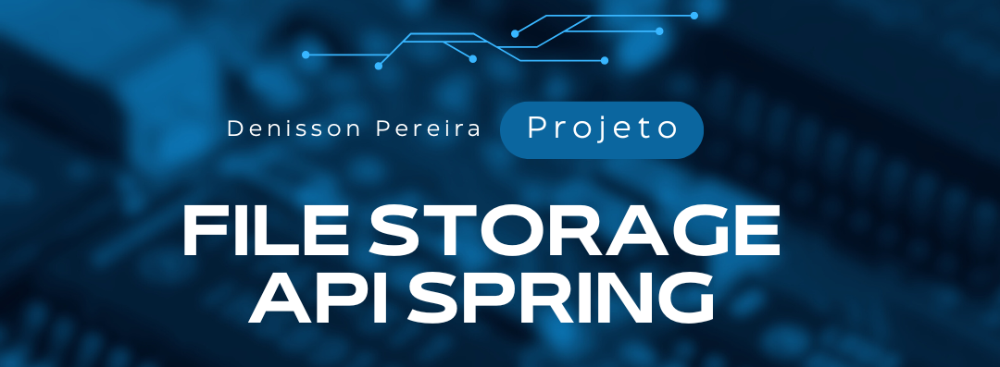
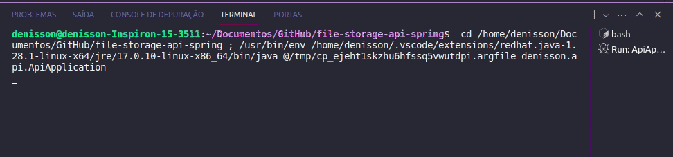

 

<p align="center">
  <a href="https://github.com/DenissonPereira/file-storage-api-spring"></a>
  <a href="https://github.com/DenissonPereira/file-storage-api-spring/issues"></a>
  <a href="https://github.com/DenissonPereira/file-storage-api-spring/graphs/contributors"></a>
  <a href="https://github.com/DenissonPereira/file-storage-api-spring/commits/main"></a>
  <a href="https://github.com/DenissonPereira/file-storage-api-spring/stargazers"></a>
</p>


# 📑 Sobre o projeto 

O projeto é uma aplicação em **java** desenvolvida utilizando o framework **Spring Boot** para oferecer uma **API** de armazenamento de arquivos. Essa **API** permite que os usuários *enviem*, *baixem* e *listem* arquivos de um diretório específico no servidor. A estrutura do projeto foi organizada de acordo com as práticas recomendadas do **Spring Boot**, incluindo a separação de classes em diferentes pacotes. A funcionalidade principal da **API** inclui o **upload de arquivos**, a **geração de links para download** e a **listagem dos arquivos disponíveis**. Com isso, o projeto proporciona uma solução eficiente e escalável para gerenciar o armazenamento e o acesso a arquivos em um ambiente de aplicação *web*.


## 📚 Stack Tecnológica


[](https://www.java.com/)
[](https://spring.io/)


# 🚀 Como executar o projeto 🚀

## ⬇️ Clonar repositório git

```
git clone https://github.com/DenissonPereira/file-storage-api-spring
```

## 👷 Construir o projeto

```
./mvnw clean package
```

## ✨ Tudo pronto! ✨

Para testar o projeto, após iniciar a aplicação, procure um arquivo e digite no terminal:

```
curl -X POST -F "file=@(nome do arquivo sem parênteses)" http://localhost:8080/api/files/upload
```

Após isso, acesse a pasta do projeto e localize a pasta de uploads. Você verá que o arquivo estará lá dentro. Outra maneira de visualizar o arquivo é usando o caminho "/list". Para isso, digite no seu navegador o seguinte endereço:

```
http://localhost:8080/api/files/list
```

# 📸 Visuals and Screenshots

Dê uma espiada no nosso projeto em funcionamento e esclareça todas as suas dúvidas sobre como executá-lo!

## 🏂 Aplicação em ação
 

## 📺 Editor de código

Neste projeto, foi utilizado o Visual Studio Code como editor de código.

[](https://code.visualstudio.com/)


# 🚨 Aguarde! Ainda não terminou!

>Este projeto está atualmente em desenvolvimento, e está sujeito a futuras atualizações e melhorias conforme evolui. Estamos trabalhando para torná-lo ainda mais robusto e funcional ao longo do tempo. Agradecemos sua paciência e interesse nesta fase inicial.

>Além disso, gostaríamos de ressaltar que este projeto é aberto a contribuições de qualquer pessoa interessada em colaborar. Se você tem ideias, sugestões ou melhorias para oferecer, sinta-se à vontade para participar do desenvolvimento do projeto. Juntos, podemos criar algo incrível e beneficiar a comunidade de forma colaborativa.

## 📜 Licença

[](https://github.com/DenissonPereira/file-storage-api-spring/blob/main/LICENSE) 

## ✏️ Autor 

Denisson Pereira Santos

<div align='center'> 
<a href="https://www.linkedin.com/in/denisson-pereira" target="_blank"></a> 
<a href="https://denissonpereira.com" target="_blank"></a> 
<a href="https://github.com/DenissonPereira" target="_blank"></a> 
<a href="https://www.instagram.com/denisson_pereira1?igshid=OGQ5ZDc2ODk2ZA%3D%3D&utm_source=qr" target="_blank"></a>
</div>&nbsp;&nbsp;